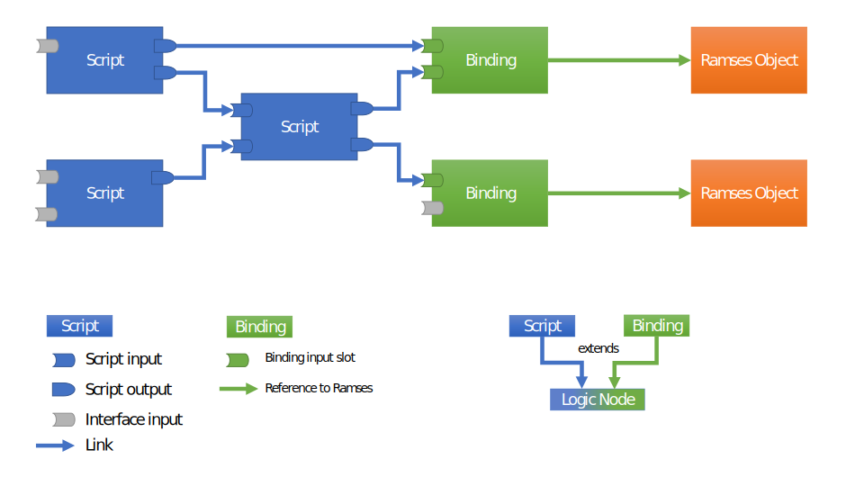

..
    -------------------------------------------------------------------------
    Copyright (C) 2020 BMW AG
    -------------------------------------------------------------------------
    This Source Code Form is subject to the terms of the Mozilla Public
    License, v. 2.0. If a copy of the MPL was not distributed with this
    file, You can obtain one at https://mozilla.org/MPL/2.0/.
    -------------------------------------------------------------------------

.. default-domain:: cpp
.. highlight:: cpp

=========================
Overview
=========================

.. note::

    Prefer learning by example? Jump straight to the :ref:`examples <List of all examples>`!
    Looking for a specific class or method? Check the :ref:`class index <Class Index>`

--------------------------------------
Object types and their relationships
--------------------------------------

The ``Logic Engine`` consists of a network of ``Lua`` scripts with a set of inputs and outputs with
links between them. A special type of object we call `binding` serves as a bridge to a Ramses scene.

The following graph shows an example of such script network:

The scripts have inputs and outputs which together define the script's ``interface``
(:ref:`more info on scripts <Script creation>`). Scripts
can be linked together directionally, so that the output of a script can provide its data to
the input of another script (:ref:`more info on links <Creating links between scripts>`).
Scripts can't interact with Ramses objects directly. Instead, they
can link to ``Bindings`` which are designed to "bind" ``Ramses`` objects and modify
their properties' values (node visibility, transformation values, material properties etc.) (:ref:`more info on bindings <Linking scripts to Ramses scenes>`).

The greyed-out slots in the image above represent input properties which are neither linked nor
have a statically configured value. In bindings, this denotes that the corresponding ``Ramses`` property
is not being updated by the ``Logic Engine`` (see also :ref:`next section <Data Flow>`). In scripts, these
properties will receive a default value at runtime (0, 0.0f, "", true etc.) unless explicitly set by the application
logic. Bindings' input values are initialized with the values of the bound `Ramses` object, for all bindings except
:class:`rlogic::RamsesAppearanceBinding`.
Usually, script inputs without a configured value or a link to other output are considered the ``interface``
of the logic network towards a runtime application, and their values are supposed to be explicitly set at runtime.

.. note::

    One of the planned features of the ``Logic Engine`` is to formalize interface inputs in a special
    interface class in a future release.

--------------------------------------
Data flow
--------------------------------------

The cornerstone of the ``Logic Engine`` is the :func:`rlogic::LogicEngine::update` method which
"executes" the network of logic nodes and updates the values of the ``Ramses`` scene bound to some of them. The nodes
are executed based on a topological graph sort, where the traversal direction is given by the link
pairs (A, B) where A is an output and B is an input property in the logic graph
(as shown :ref:`here <Object types and their relationships>`).

The update logic of each node depends on its type. ``Lua`` scripts execute their ``run()`` function
and modify some or all of their outputs based on the logic defined in ``run()``. Ramses bindings pass the values of their
input properties to the bound Ramses object.

Logic nodes are not executed on every :func:`rlogic::LogicEngine::update` iteration in order to save performance.
However, it's guaranteed that:

* scripts which were just created will be executed on next update
* scripts which inputs received a new value (either from calling :func:`rlogic::Property::set` or from a link)
  will be executed on next update
* binding properties which received a value (regardless of their current value or from the value stored in Ramses) will
  overwrite the value in Ramses on next update. This works both for direct :func:`rlogic::Property::set` calls and for values
  received over links

Additionally, bindings' properties are applied selectively - e.g. setting the ``scaling`` property of a :class:`rlogic::RamsesNodeBinding`
will result in a call to ``ramses::Node::setScaling()``, but will not cause setting any other ``ramses::Node`` properties.
This can be useful if you want to have your own logic e.g.
to control the visibility of all ``Ramses`` nodes, and only use a ``Logic Engine`` to control transformation properties. In that case
you should never set the ``visibility`` property of a Binding object, instead set the visibility directly on the bound ``ramses::Node``.

.. warning::

    We strongly discourage setting values to ``Ramses`` objects and to ``Ramses Logic`` bindings in the same update cycle
    for the same property to avoid unexpected behavior. At any given time, use one *or* the other, not both mechanisms to set values!

.. todo: Violin this behavior is still a bit inconsistent... Maybe we should change this to: scripts and bindings are not executed after load, unless an input is set before. This would be much more consistent!

The ``Logic Engine`` can be also serialized and deserialized into binary files for fast loading.
The above data flow rules still apply as if all the scripts and binding objects were just created. The first call to
:func:`rlogic::LogicEngine::update` after loading from file will execute all scripts. Binding values will only be passed further to ``Ramses``
if their values were modified, e.g. by a link which produced a different value than before saving, or if the application
called :func:`rlogic::Property::set` explicitly on any of the bindings' input properties. For more details on saving and loading,
see the :ref:`section further down <Saving/Loading from file>`.

===================================
Script creation
===================================

The entry point to ``RAMSES logic`` is a factory-style class :class:`rlogic::LogicEngine` which can
create instances of all other types of objects supported by ``RAMSES Logic``:

* :class:`rlogic::LuaScript`
* :class:`rlogic::RamsesNodeBinding`
* :class:`rlogic::RamsesAppearanceBinding`
* :class:`rlogic::RamsesCameraBinding`

You can create multiple instances of :class:`rlogic::LogicEngine`, but each copy owns the objects it
created, and must be used to destroy them, as befits a factory class.

You can create scripts using the :class:`rlogic::LogicEngine` class like this:

.. code-block::
    :linenos:
    :emphasize-lines: 5-14,16-17

    #include "ramses-logic/LogicEngine.h"

    using namespace ramses::logic;

    std::string source = R"(
        function interface()
            IN.gear = INT
            OUT.speed = FLOAT
        end

        function run()
            OUT.speed = IN.gear * 15
        end
    )"

    LogicEngine engine;
    LuaScript* script = engine.createLuaScript(source, "simple script");
    script->getInputs()->getChild("gear")->set<int32_t>(4);

    script->execute();
    float speed = script->getOutputs()->getChild("speed")->get<float>();
    std::cout << "OUT.speed == " << speed;

For details regarding the ``Lua`` syntax and its specifics, check the :ref:`dedicated section on Lua <Basics of Lua>`.

:class:`rlogic::LogicNode` (the base class of :class:`rlogic::LuaScript`) provides an interface to access the inputs and outputs declared by the ``interface()``
function - see :func:`rlogic::LogicNode::getInputs()` and :func:`rlogic::LogicNode::getOutputs()`.

You can :ref:`link scripts <Creating links between scripts>` to form a more sophisticated logic execution graph.

You can :ref:`bind to Ramses objects <Linking scripts to Ramses scenes>` to control a 3D ``Ramses`` scene.

Finally, the :class:`rlogic::LogicEngine` class and all its content can be also saved/loaded from a file. Refer to
:ref:`the section on saving/loading from files for more details <Saving/Loading from file>`.

==================================================
Object lifecycle
==================================================

All objects besides the :class:`rlogic::LogicEngine` instance follow a strict factory pattern.
An object ``X`` is created by a method of the shape ``X* LogicEngine::createX(...)``. The pointer
returned shall not be freed or deleted, instead objects must be destroyed by calling :func:`rlogic::LogicEngine::destroy`.

.. note::

    This may seem strange for a library which is based on ``C++17``, but there are good reasons
    for this design choice. Smart pointers don't work well together with Windows DLL's, specifically
    when combining different CRTs. In order to provide a stable API on Windows
    we chose to use raw pointers and hide object creation/deletion behind a pimpl/factory pattern.

The :class:`rlogic::LogicEngine` doesn't create or destroy objects on its own - all data is
explicitly created by calling ``create`` and ``destroy`` methods. There are two special cases worth mentioning:

* if :class:`rlogic::LogicEngine` is destroyed, all objects are destroyed as well and theirs pointers invalidated
* :func:`rlogic::LogicEngine::loadFromFile` destroys all objects previously created before the new content is loaded from the file

.. note::

    Loading data from files will invalidate all previous pointers to objects in
    the :class:`rlogic::LogicEngine`. To avoid that, we recommend generally avoiding using
    a logicengine instance which already has content to load from files, and instead always
    create a fresh instance.

==================================================
Creating links between scripts
==================================================

One of the complex problems of 3D graphics development is managing complexity, especially for larger projects.
For that purpose it is useful to split the application logic into multiple scripts, so that individual scripts
can remain small and easy to understand. To do that, ``Ramses Logic`` provides a mechanism to link script
properties - either statically or during runtime, in order to pass data from ``1`` producer script to ``N``
consumer scripts.

Here is a simple example how links are created:

.. code-block::
    :linenos:

    LogicEngine logicEngine;
    LuaScript* sourceScript = logicEngine.createLuaScript(R"(
        function interface()
            OUT.source = STRING
        end
        function run()
            OUT.source = "World!"
        end
    )");

    LuaScript* destinationScript = logicEngine.createLuaScript(R"(
        function interface()
            IN.destination = STRING
        end
        function run()
            print("Hello, " .. IN.destination)
        end
    )");

    logicEngine.link(
        *sourceScript->getOutputs()->getChild("source"),
        *destinationScript->getInputs()->getChild("destination"));

    // This will print 'Hello, World!' to the console
    logicEngine.update();

In this simple example, the 'sourceScript' provides string data to the 'destinationScript' every time the  ``LogicEngine::update``
method is called. The 'destinationScript' receives the data in its input property and can process  it further. After
two scripts are linked in this way, the :class:`rlogic::LogicEngine` will execute them in a order which ensures data consistency, i.e.
scripts which provide data to other scripts' inputs are executed first. In this example, the 'sourceScript' will be executed before
the 'destionationScript' because it provides data to it over the link.

Creating links as shown above enforces a so-called 'directed acyclic graph', or ``DAG``, to the :class:`rlogic::LogicNode` inside a given
:class:`rlogic::LogicEngine`. In order to ensure data consistency, this graph can not have cyclic dependencies, thus following operations
will cause an error:

* Creating a link from any :class:`rlogic::LogicNode` to itself
* Creating a link from node A to node B if node B is linked to node A (links have a direction and this creates a two-node loop!)
* Any set of :class:`rlogic::LogicNode` instances whose links form a (directed) circle, e.g. A->B->C->A (this is caught at update time, not at link creation time)

A link can be removed in a similar fashion:

.. code-block::
    :linenos:

    logicEngine.unlink(
        *sourceScript->getOutputs()->getChild("source"),
        *destinationScript->getInputs()->getChild("destination"));

For more detailed information on the exact behavior of these methods, refer to the documentation of the :func:`rlogic::LogicEngine::link`
and :func:`rlogic::LogicEngine::unlink` documentation. The `data flow section <Data Flow>`_ explains in detail how data is passed throughout the
network of logic nodes when connected by links.

==================================================
Linking scripts to Ramses scenes
==================================================

Lua scripts would not make much sense on their own if they can't interact with ``Ramses`` scene objects. The way to
link script output properties to ``Ramses`` scene objects is by creating :class:`rlogic::RamsesBinding` instances and linking their inputs to scripts' outputs.
There are different binding types depending on the type of ``Ramses`` object - refer to :class:`rlogic::RamsesBinding` for the full list of derived classes.
Bindings can be linked in the exact same way as :ref:`scripts can <Creating links between scripts>`. In fact, they derive from the
same base class - :class:`rlogic::LogicNode`. The only
difference is that the bindings have only input properties (the outputs are implicitly defined and statically linked to the Ramses
objects attached to them), whereas scripts have inputs and outputs explicitly defined in the script interface.

One might wonder, why not allow to directly link script outputs to ``Ramses`` objects?
The reason for that is two-fold:

* Separation of concerns between pure script logic and ``Ramses``-related scene updates
* This allows to handle all inputs and outputs in a generic way using the :class:`rlogic::LogicNode` class' interface from
  which both :class:`rlogic::LuaScript` and :class:`rlogic::RamsesNodeBinding` derive

The `section on data flow <Data Flow>`_ describes how data is passed throughout the network of logic nodes and when
bound Ramses objects are updated and when not.

.. note::

    Binding input values are initialized with the same values as the `Ramses` objects they "bind". The only
    exception to this are Appearance bindings - extracting all data from Ramses Appearances would incur performance
    costs not worth the convenience.

=========================
Animations
=========================

Animations are central to any dynamic real-time scene. It is possible to implement simple animations with ``Lua`` scripts
or even write your own ``C++`` wrapper which changes a value over time, linked to a ``Ramses`` object via :class:`rlogic::RamsesBinding`.
However, such solution would not scale well for more complex animations with preauthored
splines of keyframes and timestamps. :class:`rlogic::AnimationNode` and :class:`rlogic::DataArray` are designed to provide a good
compromise between performance and a data-centric design which imports animation data from external sources or formats.

The animation support in ``Ramses Logic`` is provided by the following two classes:

* :class:`rlogic::DataArray` - contains the animation data (keyframes and time stamps)
* :class:`rlogic::AnimationNode` - provides an interface to control and holds the current state of animations

Consider also using :class`rlogic::TimerNode` for easy way to generate and provide timing information to :class:`rlogic::AnimationNode`.

.. note::

    Before implementing a solution for your animation, make sure you understand the nature of animations. Is it a simple easing in/out to/from a value
    which might even change on the fly? Maybe a custom Lua script might do the job better. Is it a fixed animation or set of animations using splines
    imported from a content creation tool? Then :class:`rlogic::AnimationNode` is probably better suited for it.

-------------------------------
Data Arrays
-------------------------------

:class:`rlogic::DataArray` is a simple data container with immutable data. Various data types and interpolation types are supported (see the
class documentation for details). Data arrays by themselves have no meaning, they must be bundled in animation channels (:struct:`rlogic::AnimationChannel`).
The contents of an animation channel depends on its type. For example, a simple linear animation only needs two data arrays - one for time stamps and
one for key frames. A complex cubic animation channel also needs tangent arrays. It is possible to reuse the same data array in multiple channels - e.g.
if multiple channels use the same time stamps (often the case for multi-channel animations).

-------------------------------
Animation Nodes
-------------------------------

:class:`rlogic::AnimationNode` holds the state of an animation and provides inputs to control it and outputs to check the
output values or to link them to other scripts or directly to instances of :class:`rlogic::RamsesBinding`.
To query input and output properties, use the corresponding methods in the base class :class:`rlogic::LogicNode`.
Based on how many animation channels were provided when creating the :class:`rlogic::AnimationNode`
has an output property of corresponding data type (matching the keyframes data type) for each channel.
The value of these outputs is updated after every :func:`rlogic::LogicEngine::update` call and can be directly queried
or it can be linked to any other logic node, e.g. :class:`rlogic::RamsesBinding`.

:class:`rlogic::AnimationNode` has a set of control states, most important being ``play`` and ``timeDelta``. Whenever ``play`` is true, the animation
(all its channels) will advance in time by exactly ``timeDelta`` period everytime update is executed. Animation starts at time zero of all of its
channels' timestamps, interpolates keyframes according to the interpolation type chosen for each channel and when the end is reached the value stays equal
to last keyframe. The default time range [0, end] can be changed by setting custom begin and end via ``timeRange``.
Animation can be set to looping via ``loop`` or restarted via ``rewindOnStop`` inputs.

-------------------------------
Time Delta
-------------------------------

A typical application using ``Ramses logic`` has a main loop and in each iteration
(among other things) user and system inputs are processed, logic network inputs are set and finally :func:`rlogic::LogicEngine::update` is called.
Typically, logic nodes are stateless and only do something when an input value is changed/set. Animation nodes bring in a new implicit input - `time`.
The ``Logic Engine`` allows (and therefore also requires) the application logic to update its time based on its own loop logic and requirements.
This is done for each animation node separately over its ``timeDelta`` input property. This allows for two things:

* simulating time
* stopping time
* doing the above for each animation node separately

In a typical setup, ``timeDelta`` is a relative value representing the time period between the updates, `timeDelta = timeNow - timeLastUpdate`.
Note that even if ``timeDelta`` has the same value in two consecutive frames, it still needs to be set if the animation node's logic is supposed to
be updated. It is possible to set a value of 0 which will trigger an update of the animation node, but not progress the time (e.g. if you load
a file with running animations and want to re-apply their current value without progressing the time).

.. note::

    There is intentionally no mention of time units when describing usage of ``timeDelta``, that is because ``Ramses logic`` is time unit agnostic
    when it comes to animations. It is fully up to the application to define the time units passed to animations to match those in the animation timestamps.
    The type of ``timeDelta`` is ``float`` in order to match default glTF semantics (time is represented in seconds with float precision for sub-second fractions).

If you have a trivial time logic which applies a fixed time delta each frame, you can simply traverse all animations and apply a fixed value:

.. code-block::
    :linenos:

    void doOneLoop()
    {
        ...

        const auto timeNow = now();
        const auto timeDelta = timeNow - lastUpdateTime;
        lastUpdateTime = timeNow;

        for (const auto& animNode : logicEngine.animationNodes())
        {
            // It may be a good idea to cache the timeDelta property for better performance
            auto* timeDelta = animNode->getInputs()->getChild("timeDelta");
            timeDelta->set(timeDelta);
        }

        logicEngine.update();
    }

This may seem like an overkill for simply progressing the time of all animations, but it allows for flexible time control
and gives full power to the application code as to how and when to update animations at the cost of few lines of boilerplate
code.

=========================
Error handling
=========================

Some of the ``RAMSES Logic`` classes' methods can issue errors when used incorrectly or when
a ``Lua`` script encounters a compile-time or run-time error. Those errors are globally collected
by the :class:`rlogic::LogicEngine` class and can be obtained by calling :func:`rlogic::LogicEngine::getErrors()`.
The error information stored in :struct:`rlogic::ErrorData` contains additional stack trace information for Lua runtime errors,
and a pointer to the originating :class:`rlogic::LogicNode` which caused the error for errors which occured during :func:`rlogic::LogicEngine::update()`
and can't be directly attributed to a specific API call.
Beware that any of the mutable methods of :class:`rlogic::LogicEngine` clear the previously generated errors
in the list, so that the list only ever contains the errors since the last method call!

For code samples which demonstrate how compile-time and runtime errors can be gracefully handled,
have a look at the :ref:`examples <List of all examples>`.

=====================================
Iterating over object collections
=====================================

Iterating over objects can be useful, for example when :ref:`loading content from files <Saving/Loading from file>`
or when applying search or filter algorithms over all objects from a specific type.
The :class:`rlogic::LogicEngine` class provides iterator-style access to all of its objects:

.. code-block::
    :linenos:

    LogicEngine logicEngine;
    Collection<LuaScript> allScripts = logicEngine.scripts();

    for(const auto script : allScripts)
    {
        std::cout << "Script name: " << script->getName() << std::endl;
    }

The :class:`rlogic::Collection` class and the iterators it returns are STL-compatible, meaning that you can use them with any
other STL algorithms or libraries which adhere to STL principles. The iterators implement ``forward`` iterator semantics
(`have a look at C++ docs <https://en.cppreference.com/w/cpp/named_req/ForwardIterator>`_).

.. note::

    The :class:`rlogic::Iterator` and :class:`rlogic::Collection` classes are not following the ``pimpl`` pattern as the rest of
    the ``Ramses Logic`` to performance ends. Be careful not to depend on any internals of the classes (mostly the Internally
    wrapped STL containers) to avoid compatibility problems when updating the ``Ramses Logic`` version!

=====================================
Saving/Loading from file
=====================================

The :class:`rlogic::LogicEngine` class and its content can be stored in a file and loaded from file again using the functions
:func:`rlogic::LogicEngine::saveToFile` and :func:`rlogic::LogicEngine::loadFromFile`. The latter has an optional argument
to provide a ``Ramses`` scene which should be used to resolve references to Ramses objects in the Logic Engine file. Read
further for more details.

.. note::

    Even though it would be technically possible to combine the storing and loading of Ramses scenes together with the Logic Engine
    and its scripts in a single file, we decided to not do this but instead keep the content in separate files and load/save it independently.
    This allows to have the same Ramses scene stored multiple times or with different settings, but using the same logic content,
    as well as the other way around - having different logic implementations based on the same Ramses scene. It also leaves more freedom
    to choose how to store the Ramses scene. This implies that at most a single Ramses scene can be referenced at the time of saving,
    having more than one scene will result in error.

--------------------------------------------------
Object lifecycle when saving and loading to files
--------------------------------------------------

After loading,
the current state of the logic engine objects will be completely overwritten by the contents from the file. If you don't want this behavior,
use two different instances of the class - one dedicated for loading from files and nothing else.

Here is a simple example which demonstrates how saving/loading from file works in the simplest case (i.e. no references to Ramses objects):

.. code-block::
    :linenos:

    // Creates an empty LogicEngine instance, saves it to file and destroys the object
    {
        rlogic::LogicEngine engine;
        engine.saveToFile("logicEngine.bin");
    }
    // Loads the file we saved above into a freshly created LogicEngine instance
    {
        rlogic::LogicEngine engine;
        engine.loadFromFile("logicEngine.bin");
    }

After the call to :func:`rlogic::LogicEngine::loadFromFile` successfully returns (refer to the :ref:`Error handling` section
for info on handling errors), the state of the :class:`rlogic::LogicEngine` class will be overwritten with
the contents loaded from the file. This implies that all objects created prior loading will be deleted and pointers to them
will be pointing to invalid memory locations. We advise designing your object lifecycles around this and immediately dispose
such pointers after loading from file.

.. warning::

    In case of error during loading the :class:`rlogic::LogicEngine` may be left in an inconsistent state. In the future we may implement
    graceful handling of deserialization errors, but for now we suggest discarding a :class:`rlogic::LogicEngine` object which failed to load.

--------------------------------------------------
File compatibility
--------------------------------------------------

Since version ``0.7.0``, Ramses Logic binary files are backwards compatible.
This means that a newer version of the runtime can be used to load an older binary file, unless the file format version
had a breaking change and a newer version of the Logic Engine must be used.
The exact compatibility info is documented in the `version matrix <https://ramses-logic.readthedocs.io/en/latest/readme_ref.html#version-matrix>`_.
There are some limitations:

* Loading a file older than v0.7.0 will result in an error with a runtime equal or newer than v0.7.0
* Adding new features will still break the format and require re-export. We will explicitly list such breaking changes in the version matrix.

--------------------------------------------------
Saving and loading together with a Ramses scene
--------------------------------------------------

In a slightly less simple, but more realistic setup, the Logic Engine will contain objects of type ``Ramses<Object>Binding`` which
contain references to Ramses objects. In that case, use the optional ``ramses::Scene*`` argument to :func:`rlogic::LogicEngine::loadFromFile`
to specify the scene from which the references to Ramses objects should be resolved. ``Ramses Logic`` uses the ``getSceneObjectId()`` method of the
``ramses::SceneObject`` class to track references to scene objects. This implies that those IDs must be the same after loading, otherwise
:func:`rlogic::LogicEngine::loadFromFile` will report error and fail. ``Ramses Logic`` makes no assumptions on the origin of the scene, its name
or ID.

For a full-fledged example, have a look at :ref:`the serialization example <Save/load from file example>`.

.. warning::

    The ``LogicEngine`` expects that immediately after loading, the state of the ``Ramses`` scene is the same as it was right before saving, and will not
    modify ``Ramses`` objects which are attached to bindings in the ``LogicEngine`` in its first update, unless they are linked to scripts or explicitly
    overwritten by :func:`rlogic::Property::set` calls after loading from the file. We strongly advice to always save and load
    both the ``Ramses`` scene and the ``LogicEngine`` scene together to avoid data inconsistencies!

--------------------------------------------------
Using memory buffer instead of file
--------------------------------------------------

You can use :func:`rlogic::LogicEngine::loadFromBuffer` to load the contents of the logic engine from your own memory. This can be useful
if you have your own file management logic, or the data comes from a different source than a file on disk. Be mindful that passing data buffers
over the boundaries of libraries can be unsafe with C++, and some errors/abuse can't be reliably prevented. Make sure you check the size of
the buffer and don't load from memory of untrusted origins.

=========================
Logging
=========================

Internally there are four log levels available.

* Info
* Debug
* Warn
* Error

By default all internal logging messages are sent to std::cout. You can toggle this with :func:`rlogic::Logger::SetDefaultLogging`.
In addition, it is possible to have a custom log handler function which is called each time a log message is issued.

.. code-block::
    :linenos:

    #include <iostream>

    Logger::SetLogHandler({
        switch(type)
        {
            case ELogMessageType::ERROR:
                std::cout << "Error: " << message << std::endl;
                break;
            default:
                std::cout << message << std::endl;
                break;
        }
    });

Inside the log handler function, you get the type of the message and the message itself as a std::string_view.
Keep in mind, that you can't store the std::string_view. It will be invalid after the call to the log handler
function. If you need the message for later usage, store it in a std::string.

The amount of logging can be configured with :func:`rlogic::Logger::SetLogVerbosity`. This affects both the default
logging and the custom logger.

======================================
Security and memory safety
======================================

One of the biggest challenges of modern ``C++`` is finding a balance between compatibility with older compilers
and platforms, while not sacrificing memory safety and code readibility. In the ``RAMSES`` ecosystem we try to
find a good balance by testing with different compilers, employing automation techniques and making use of
modern compiler-based tools to perform static code analysis and introspection. The methods and tools we use are:

* compiling on different compilers (MSVC, gcc, clang) with strict compiler settings
* clang-tidy with fairly strict configuration
* valgrind
* treat warnings as errors
* use various clang-based sanitizers (undefined behavior, thread sanitizer, address sanitizer)

Those tools cover a lot of the standard sources of problems with ``C++`` revolving around memory. We also uphold
a strict code review, ensuring that each line of code is looked at by at least two pairs of eyes, for critical
parts of the code usually more than that. Still, no project is safe from bugs, thus we recommend following
some or all of the additional conventions and best practices from below subchapters to minimize the risk of
memory-related bugs and malicious attacks when using ``Ramses Logic``.

-----------------------------------------------------
Additional memory safety measures
-----------------------------------------------------

One of the biggest sources of bugs and security problems in ``C++`` arise from memory management, both in terms of
allocation/deallocation and memory access and boundary checks. ``Ramses Logic`` takes care of memory lifecycle
for all objects created by it, and provides raw pointer access to their memory. We suggest creating your own wrapper
objects for anything created or loaded by the :class:`rlogic::LogicEngine` class and ensure it is destroyed exactly once
and only after not used any more.

Furthermore, pay special attention when passing strings as ``std::string_view`` to and from the ``Logic Engine`` as those
may not be terminated by a 0 and may lead to out of bounds accesses when used by functions expecting 0-termination.

-----------------------------------------------------
Additional security considerations
-----------------------------------------------------

``Lua`` is a script language, and as such provides great flexibility and expresiveness at the cost of
more error potential and security risks compared to other techniques for describing logic. The ``Logic engine`` and the
underlying ``sol`` library do a lot of error checking and prevents undefined behavior by executing faulty script code,
but there are cases which can't be checked.

To give one example, a script may overwrite the global variables ``IN`` or ``OUT``
from within script code because of the nature of ``Lua`` scripts. This can't be automatically checked by the runtime without
overloading the global ``Lua`` metatable and injecting every single assignment operation, which is too high a cost to avoid
faulty scripts.

To avoid malicious or broken script, we suggest implementing an additional security mechanism on top
of ``Ramses Logic`` which doesn't allow execution of scripts of unknown origin. Also, build your code with errors in mind
and force scripts into an automated testing process. We also advise to use hashsums and whitelisting techniques to only
execute scripts which are tested and verified to be benign.

.. TODO add more docs how environment work, what is the level of isolation between different scripts etc.

-----------------------------------------------------
Sanitizing of files and buffers
-----------------------------------------------------

Since the ``Logic Engine`` can deserialize itself from files and memory buffers, it opens possibilities for data corruption and
truncation. To mitigate those risks, we use Flatbuffer's "Verify" feature which checks the integrity of data,
detects possible index-out-of-range issues and prevents binary data abuse. What it *doesn't* check is
whether the actual memory buffer size (passed in :func:`rlogic::LogicEngine::loadFromBuffer`) is consistent with the size provided
by the user. The application must ensure that this size does not exceed the size of the actual memory!

=========================
Performance
=========================

The ``Logic Engine`` is designed to be fast and efficient, as long as the performance improvements are
not made at cost of unreadable code. In order to be able to track and improve
the runtime of the ``Logic Engine``, we maintain a set of benchmarks based on the google-benchmark library.
These benchmarks can be used to measure the time it takes for specific operations under different loads.
We kindly ask our users and developers to report performance problems by creating a benchmark which describes
the specific use-case which needs optimizing. Refer to the
`google-benchmark docs <https://github.com/google/benchmark>`_ for hints how to
design good benchmarks, to set the time measurement units, derive O-complexity, etc.

The SDK also provides means to do basic measuring of logic network update times. See :class:`rlogic::LogicEngineReport`
which gives several useful statistics, e.g. which nodes where executed and how long it took for each of them.
We suggest to collect this data over several update cycles in some worst case scenario (performance-wise)
and investigate which nodes take the most time to update. Also for normal use cases consider taking a look at
how many nodes were needed to be updated and if the topology could be improved so that this amount is reduced
to only the necessary nodes.

=========================
List of all examples
=========================

.. toctree::
    :maxdepth: 1
    :caption: Examples

    examples/00_minimal
    examples/01a_primitive_properties
    examples/01b_struct_properties
    examples/01c_array_properties
    examples/02_errors_compile_time
    examples/03_errors_runtime
    examples/04_ramses_scene
    examples/05_serialization
    examples/07_links
    examples/08_animation
    examples/09_modules
